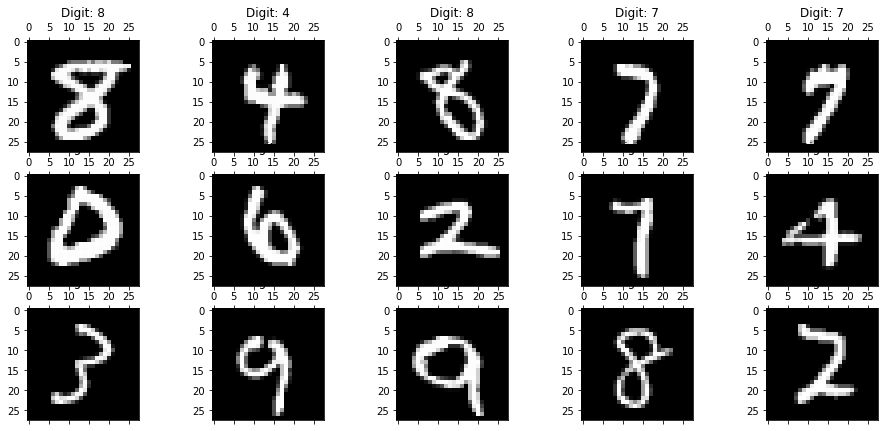
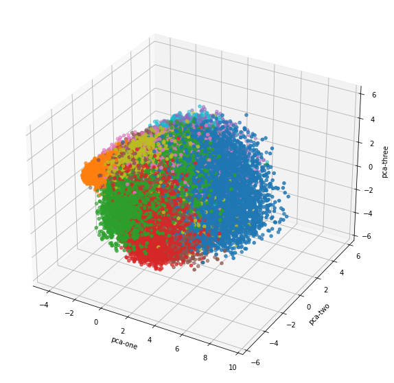
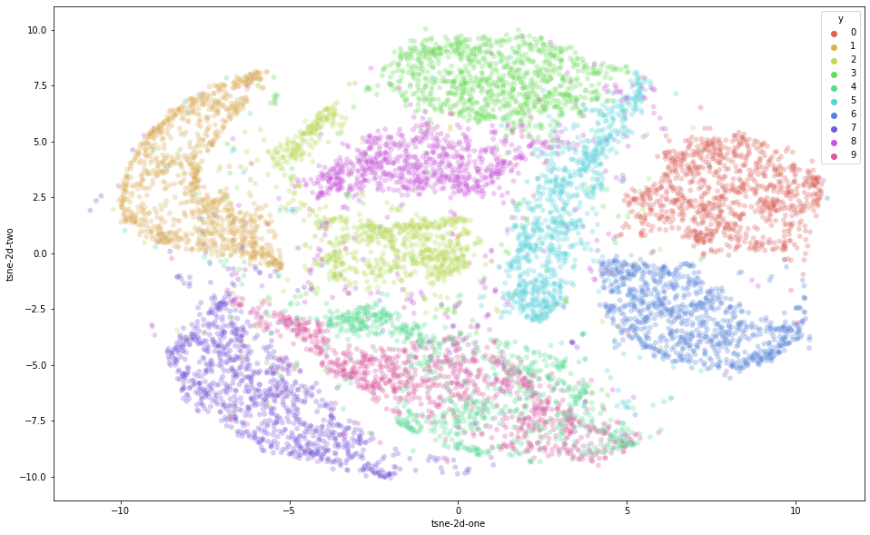
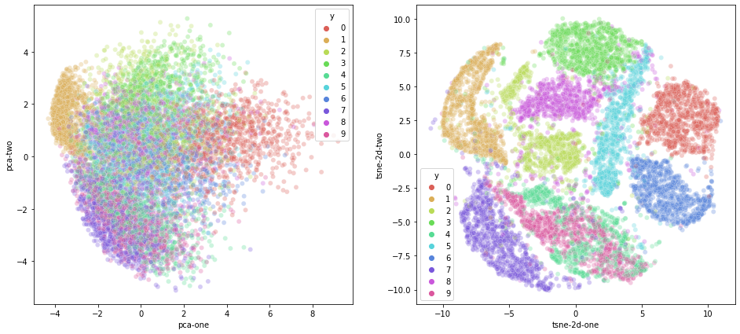

```python
# Copy and paste from
# https://towardsdatascience.com/visualising-high-dimensional-datasets-using-pca-and-t-sne-in-python-8ef87e7915b
# with trivial modifications
#
# Author: Nobody in Computer Vision
# Date: 2022-03-04
# 
# Contacts:
# Company: Longer Vision Technology
# Email: jiapei@longervision.com
# Website: https://www.longervision.com
```


```python
from __future__ import print_function
import time
import numpy as np
import pandas as pd
from sklearn.datasets import fetch_openml
from sklearn.decomposition import PCA
from sklearn.manifold import TSNE
%matplotlib inline
import matplotlib.pyplot as plt
from mpl_toolkits.mplot3d import Axes3D
import seaborn as sns
```


```python
mnist = fetch_openml("mnist_784")
X = mnist.data / 255.0
y = mnist.target
print(X.shape, y.shape)

```

    (70000, 784) (70000,)


```python
feat_cols = [ 'pixel'+str(i+1) for i in range(X.shape[1]) ]
df = pd.DataFrame(X,columns=feat_cols)
df['y'] = list(map(int, y))
df['label'] = y.apply(lambda i: str(i))
print('Size of the dataframe: {}'.format(df.shape))
X, y = None, None
```

    Size of the dataframe: (70000, 786)


```python
# For reproducability of the results
np.random.seed(42)
rndperm = np.random.permutation(df.shape[0])
```


```python
plt.gray()
fig = plt.figure( figsize=(16,7) )
for i in range(0,15):
    ax = fig.add_subplot(3,5,i+1, title="Digit: {}".format(str(df.loc[rndperm[i],'label'])) )
    ax.matshow(df.loc[rndperm[i],feat_cols].values.reshape((28,28)).astype(float))
plt.show()
```


    <Figure size 432x288 with 0 Axes>


    

    


```python
pca = PCA(n_components=3)
pca_result = pca.fit_transform(df[feat_cols].values)
df['pca-one'] = pca_result[:,0]
df['pca-two'] = pca_result[:,1] 
df['pca-three'] = pca_result[:,2]
print('Explained variation per principal component: {}'.format(pca.explained_variance_ratio_))
```

    Explained variation per principal component: [0.09746116 0.07155445 0.06149531]


```python
plt.figure(figsize=(16,10))
sns.scatterplot(
    x="pca-one", y="pca-two",
    hue="y",
    palette=sns.color_palette("hls", 10),
    data=df.loc[rndperm,:],
    legend="full",
    alpha=0.3
)
```


    <AxesSubplot:xlabel='pca-one', ylabel='pca-two'>


    

    


```python
df
c=df.loc[rndperm,:]["label"]
print(c)
print(type(c))
```

    46730    8
    48393    4
    41416    8
    34506    7
    43725    7
            ..
    37194    6
    6265     6
    54886    1
    860      0
    15795    0
    Name: label, Length: 70000, dtype: category
    Categories (10, object): ['0', '1', '2', '3', ..., '6', '7', '8', '9']
    <class 'pandas.core.series.Series'>


```python
ax = plt.figure(figsize=(16,10)).add_subplot(projection='3d')
ax.scatter(
    xs=df.loc[rndperm,:]["pca-one"], 
    ys=df.loc[rndperm,:]["pca-two"], 
    zs=df.loc[rndperm,:]["pca-three"], 
    c=df.loc[rndperm,:]["y"], 
    cmap='tab10'
)
ax.set_xlabel('pca-one')
ax.set_ylabel('pca-two')
ax.set_zlabel('pca-three')
plt.show()

```


    

    


```python
N = 10000
df_subset = df.loc[rndperm[:N],:].copy()
data_subset = df_subset[feat_cols].values
pca = PCA(n_components=3)
pca_result = pca.fit_transform(data_subset)
df_subset['pca-one'] = pca_result[:,0]
df_subset['pca-two'] = pca_result[:,1] 
df_subset['pca-three'] = pca_result[:,2]
print('Explained variation per principal component: {}'.format(pca.explained_variance_ratio_))
```

    Explained variation per principal component: [0.09819946 0.07123677 0.06113222]


```python
time_start = time.time()
tsne = TSNE(n_components=2, learning_rate='auto', init='pca', verbose=1, perplexity=40, n_iter=300)
tsne_results = tsne.fit_transform(data_subset)
print('t-SNE done! Time elapsed: {} seconds'.format(time.time()-time_start))
```

    [t-SNE] Computing 121 nearest neighbors...
    [t-SNE] Indexed 10000 samples in 0.003s...
    [t-SNE] Computed neighbors for 10000 samples in 1.547s...
    [t-SNE] Computed conditional probabilities for sample 1000 / 10000
    [t-SNE] Computed conditional probabilities for sample 2000 / 10000
    [t-SNE] Computed conditional probabilities for sample 3000 / 10000
    [t-SNE] Computed conditional probabilities for sample 4000 / 10000
    [t-SNE] Computed conditional probabilities for sample 5000 / 10000
    [t-SNE] Computed conditional probabilities for sample 6000 / 10000
    [t-SNE] Computed conditional probabilities for sample 7000 / 10000
    [t-SNE] Computed conditional probabilities for sample 8000 / 10000
    [t-SNE] Computed conditional probabilities for sample 9000 / 10000
    [t-SNE] Computed conditional probabilities for sample 10000 / 10000
    [t-SNE] Mean sigma: 2.117974


    /home/lvision/.local/lib/python3.8/site-packages/sklearn/manifold/_t_sne.py:982: FutureWarning: The PCA initialization in TSNE will change to have the standard deviation of PC1 equal to 1e-4 in 1.2. This will ensure better convergence.
      warnings.warn(


    [t-SNE] KL divergence after 250 iterations with early exaggeration: 85.990288
    [t-SNE] KL divergence after 300 iterations: 2.786253
    t-SNE done! Time elapsed: 8.129722356796265 seconds


```python
df_subset['tsne-2d-one'] = tsne_results[:,0]
df_subset['tsne-2d-two'] = tsne_results[:,1]
plt.figure(figsize=(16,10))
sns.scatterplot(
    x="tsne-2d-one", y="tsne-2d-two",
    hue="y",
    palette=sns.color_palette("hls", 10),
    data=df_subset,
    legend="full",
    alpha=0.3
)
```


    <AxesSubplot:xlabel='tsne-2d-one', ylabel='tsne-2d-two'>


    

    


```python
plt.figure(figsize=(16,7))
ax1 = plt.subplot(1, 2, 1)
sns.scatterplot(
    x="pca-one", y="pca-two",
    hue="y",
    palette=sns.color_palette("hls", 10),
    data=df_subset,
    legend="full",
    alpha=0.3,
    ax=ax1
)
ax2 = plt.subplot(1, 2, 2)
sns.scatterplot(
    x="tsne-2d-one", y="tsne-2d-two",
    hue="y",
    palette=sns.color_palette("hls", 10),
    data=df_subset,
    legend="full",
    alpha=0.3,
    ax=ax2
)
```


    <AxesSubplot:xlabel='tsne-2d-one', ylabel='tsne-2d-two'>


    

    


```python
pca_50 = PCA(n_components=50)
pca_result_50 = pca_50.fit_transform(data_subset)
print('Cumulative explained variation for 50 principal components: {}'.format(np.sum(pca_50.explained_variance_ratio_)))

```

    Cumulative explained variation for 50 principal components: 0.8261769578399734


```python
time_start = time.time()
tsne = TSNE(n_components=2, learning_rate='auto', init='pca', verbose=0, perplexity=40, n_iter=300)
tsne_pca_results = tsne.fit_transform(pca_result_50)
print('t-SNE done! Time elapsed: {} seconds'.format(time.time()-time_start))
```

    /home/lvision/.local/lib/python3.8/site-packages/sklearn/manifold/_t_sne.py:982: FutureWarning: The PCA initialization in TSNE will change to have the standard deviation of PC1 equal to 1e-4 in 1.2. This will ensure better convergence.
      warnings.warn(


    t-SNE done! Time elapsed: 7.227182388305664 seconds


```python
df_subset['tsne-pca50-one'] = tsne_pca_results[:,0]
df_subset['tsne-pca50-two'] = tsne_pca_results[:,1]
plt.figure(figsize=(16,4))
ax1 = plt.subplot(1, 3, 1)
sns.scatterplot(
    x="pca-one", y="pca-two",
    hue="y",
    palette=sns.color_palette("hls", 10),
    data=df_subset,
    legend="full",
    alpha=0.3,
    ax=ax1
)
ax2 = plt.subplot(1, 3, 2)
sns.scatterplot(
    x="tsne-2d-one", y="tsne-2d-two",
    hue="y",
    palette=sns.color_palette("hls", 10),
    data=df_subset,
    legend="full",
    alpha=0.3,
    ax=ax2
)
ax3 = plt.subplot(1, 3, 3)
sns.scatterplot(
    x="tsne-pca50-one", y="tsne-pca50-two",
    hue="y",
    palette=sns.color_palette("hls", 10),
    data=df_subset,
    legend="full",
    alpha=0.3,
    ax=ax3
)
```


    <AxesSubplot:xlabel='tsne-pca50-one', ylabel='tsne-pca50-two'>


    

    

